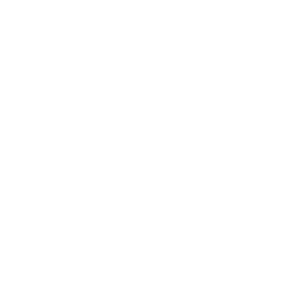

# We help small companies build the software they actually need

Sometimes this means custom development. Sometimes it means giving you user friendly tools so you can build it yourself, without writing a line of code. Sometimes it means joining your team to help ship what you're already building. Either way, we start by listening. You can reach out to us at [hi@tutuf.com](mailto:hi@tutuf.com).

# tutuf way

We build web apps since 2007. We always ask a lot of questions in order to understand our clients’ needs before we program. We deploy often to a test environment and refine the software based on the clients’ feedback. We automate tests to keep cost of change low. We outsource coding to AI agents but never the thinking.

We have experience in building from scratch as well as maintaining and improving legacy systems. Our biggest project is [custom-built online shop](https://laptop.bg): 17 years, seven-digit number of customers, double-digit sustained annual growth.

# tutuf team

* [Denitsa Belogusheva](https://github.com/denitsa) - manager and lead developer, co-founder
* [Sava Lachezarov](https://github.com/kanmeiban) - systems design and development, co-founder
* [Gabriela Velinova](https://github.com/luhova) - senior developer, joined 2015

We are graduates of the [Faculty of Mathematics and Informatics](https://fmi.uni-sofia.bg/) at the [Saint Kliment Ohridski University of Sofia](https://uni-sofia.bg/index.php/eng).

# tutuf culture

We build products with a strong focus on long-term value. We practice collective ownership, close collaboration, and continuous improvement of both technical and interpersonal skills.

We value mutual trust, proactivity, and commitment to building high-quality software that is a pleasure both to use and to maintain. The engineering expertise is as important for us as teamwork and open communication.

We're a small team by choice because  quality is more important than quantity. A thousand hands are needless, if one knows exactly where to touch.

Success for us is not getting unhandsomely rich but having the satisfaction of job well done and enough time to enjoy life outside of work. 

Beyond commisioned projects, we mentor interns to become full-fledged developers, we contribute to open source, and we support the local Ruby community.

We are a remote company, and we love to meet in-person occasionally to keep the human connection. And we are playful!

# tutuf policy

We don’t work with gambling, tobacco, and weapons companies as well as those engaging in exploitative practices, harmful addiction, or environmentally damaging activities.

We try to minimize our footprint by using our hardware as long as we can. Climate change is real, and infinite growth on a finite planet is impossible.

# tutuf tech stack

We build with [Ruby on Rails](https://rubyonrails.org/) and [PostgreSQL](https://postgresql.org/).

We are experienced in event-driven architectures, API design, distributed systems and service integration.

We maintain several open source [Ruby gems](https://github.com/tutuf/).

# tutuf hall of fame

* [Stefan Kanev](https://github.com/skanev) - Chief Technology Officer at Dext
* [Tsanka Dobreva](https://github.com/tsankaste) - Rails developer
* [Siyana Kaneva](https://github.com/skanevaa) - Rails developer
* [Georgi Peshev](https://github.com/EL-34) - QA engineer

# tutuf internship

We have been running internship programs since 2010. If you are a student or recent graduate who knows or wants to learn Ruby, and you share our work ethic, please, send us a cover letter at [jobs@tutuf.com](mailto:jobs@tutuf.com).

---
Made in Bulgariai

)

